# Set up your computing environment

Please read and follow the below steps as soon as you can so that we can ensure that we run into minimal issues on the day of the classes. If you have any problems, feel free to [email Kazu](mailto:kterao@slac.stanford.edu) or to contact us on the [Slack channel](https://kmi-2020.slack.com/app_redirect?channel=ta).

## Accounts and Access

The [SLAC Shared Scientific Data Facility (SDF)](https://sdf.slac.stanford.edu) is a computing cluster at SLAC Accelerator National Laboratory. It is specifically designed for the need of the Machine Learning community at SLAC. We shall be using SDF for this workshop!

We have prepared a temporary computing account for every participant. Everyone should have received the account information (user name and password) by an email. Please do not share your user name nor password with anyone else.

# Getting started

Below is an instruction for how to log into a computing server prepared for the workshop, and the basics of how to use Jupyter lab, a browser-based application to navigate through SLAC computing environment.

Texts are not always the best way to explain, so I also recorded movies for each section.
- How to login ([movie](https://stanford.zoom.us/rec/share/1I7HgP8pHT1NX-SgYHCxbnCtz2uW_pqXPfg1_sBJK7IhWbgo7_SwSqC5xSxIhHCo.ieafVKov0x66nksp?startTime=1605331094000))
- Launch jupyter ([movie](https://stanford.zoom.us/rec/share/1I7HgP8pHT1NX-SgYHCxbnCtz2uW_pqXPfg1_sBJK7IhWbgo7_SwSqC5xSxIhHCo.ieafVKov0x66nksp?startTime=1605331285000))
- Verify it works ([movie](https://stanford.zoom.us/rec/share/1I7HgP8pHT1NX-SgYHCxbnCtz2uW_pqXPfg1_sBJK7IhWbgo7_SwSqC5xSxIhHCo.ieafVKov0x66nksp?startTime=1605331894000))
- Prepare materials ([movie](https://stanford.zoom.us/rec/share/1I7HgP8pHT1NX-SgYHCxbnCtz2uW_pqXPfg1_sBJK7IhWbgo7_SwSqC5xSxIhHCo.ieafVKov0x66nksp?startTime=1605332085000))

## 1. Login
Follow the instruction below and/or [movie](https://stanford.zoom.us/rec/share/1I7HgP8pHT1NX-SgYHCxbnCtz2uW_pqXPfg1_sBJK7IhWbgo7_SwSqC5xSxIhHCo.ieafVKov0x66nksp?startTime=1605331094000).

* Goto https://sdf.slac.stanford.edu in your web browser (sorry, Safari not supported). You are more than welcome to browse the documentation, but it is not necessarily.
* Click on the "Login" button
* You will be presented with a CILogon screen. Select **SLAC National Accelerator Laboratory** from the drop down list.
  * If you selected another authentication other than SLAC, you may be presented with an error message sayng that your user name could not be mapped. To rectify this, you will need to [logout (click this link)](https://sdf.slac.stanford.edu/logout) and try again.
* The standard SLAC single-sign-on-page will be presented: enter your user name and password provided in an email.

You should be presented with the 'ondemand' frontend that looks like below.

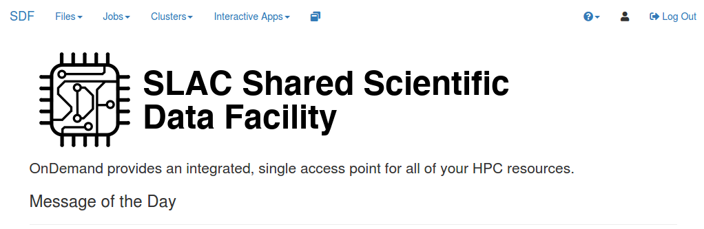

## 2. Launch jupyter
Follow the instruction below and/or [movie](https://stanford.zoom.us/rec/share/1I7HgP8pHT1NX-SgYHCxbnCtz2uW_pqXPfg1_sBJK7IhWbgo7_SwSqC5xSxIhHCo.ieafVKov0x66nksp?startTime=1605331285000).

- at the top of the 'ondemand' webpage that we just logged into, click on 'Interactive Apps'
- Select 'Jupyter' from the list
- You should be presented with a set of options to launch a Jupyter instance

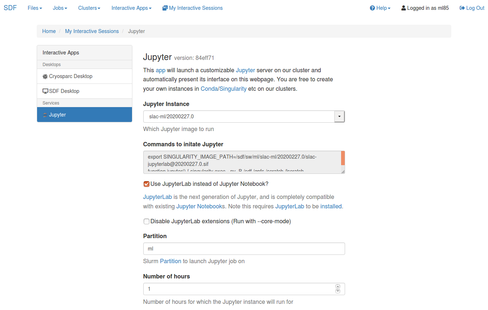

- For the purposes of this school, select
  - Jupyter Instance: `ml-at-slac/school-2020-09`
  - Check "Use JupyterLab"
  - Partition: `ml`
  - Number of hours: `12`
  - Number of CPU cores: `4`
  - Total Memory to allocate: `19200`
  - Number of GPUs: `1`
  - GPU Type: `Nvidia Geforce 2080Ti`
  - **Leave unchecked** "I would like to receive an email when the session starts"
    - This email goes to one of my colleagues, not your email, as it is a temporary account
- Click on the big blue 'Launch' button at the bottom.

If you get an error like `sbatch: error: Batch job submission failed: Invalid account or account/partition combination specified`, this means that you do not have permissions to use the `ml` partition in slurm. Contact [Kazu](mailto:kterao@slac.stanford.edu) of one of TAs on the [Slack channel](https://kmi-2020.slack.com/app_redirect?channel=ta). While this problem persists, you can use the `shared` partition instead (or whichever you may be a part of).


- If successful, that should bring you to "Interactive Sessions" page like below.

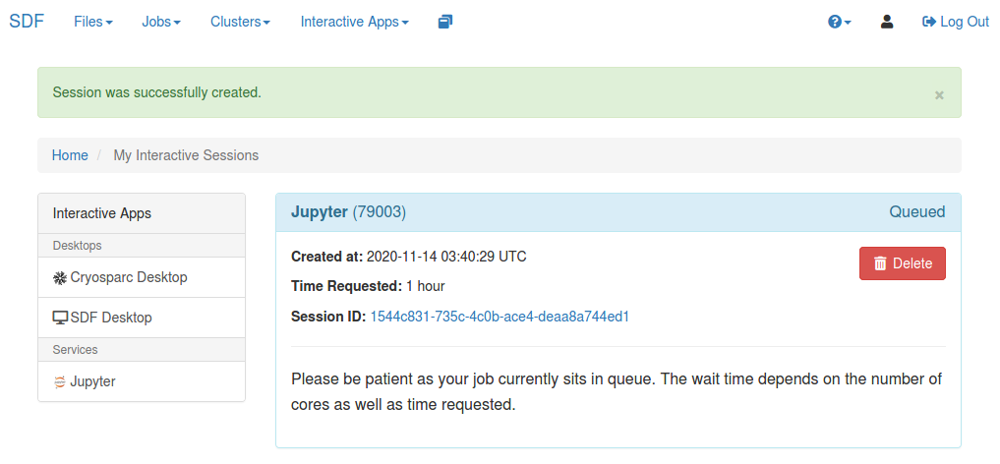

- After a few moments, the webpage should update with a 'Connect to Jupyter Instance' button

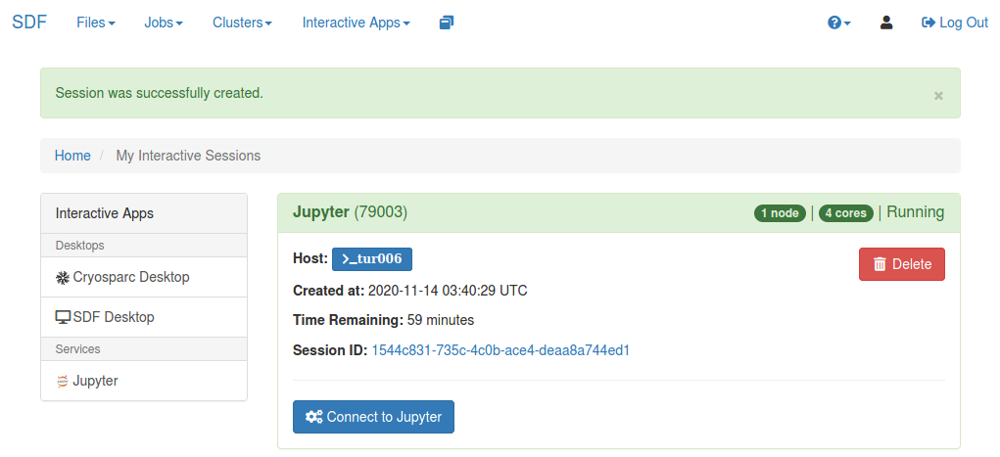

- clicking on this will bring up a Jupyter window. That should bring you to Jupyter homepage.

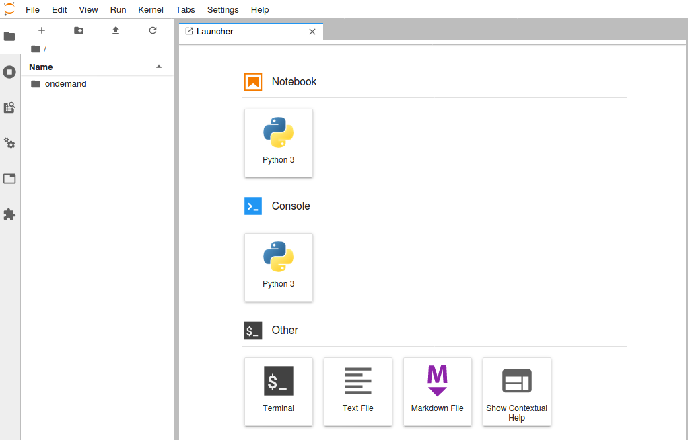

## 3. Verify it works
Follow the instruction below and/or [movie](https://stanford.zoom.us/rec/share/1I7HgP8pHT1NX-SgYHCxbnCtz2uW_pqXPfg1_sBJK7IhWbgo7_SwSqC5xSxIhHCo.ieafVKov0x66nksp?startTime=1605331894000).

- Start a python interpreter console from the launcher

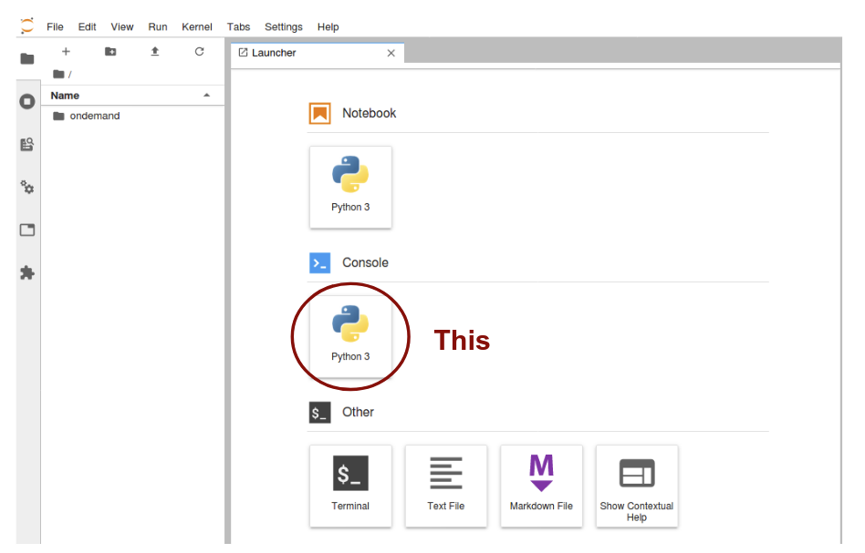

- That should open a python interpreter console. You should see a screen like below.

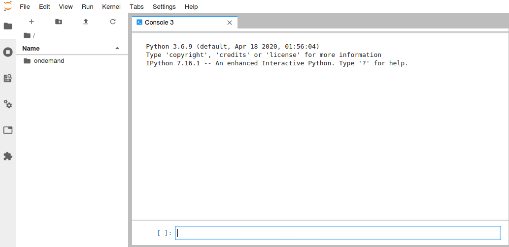

- You can type python commands in the bottom cell. Type the following 2 lines of command:
```
import torch
print(torch.Tensor([0.]).cuda().device)
```
... and _execute_ the cell (you can hit "shift+enter" on your keyboard). You should see the output on the screen:
```
cuda: 0
```
If you see any error, please contact [Kazu](mailto:kterao@slac.stanford.edu).

## 4. Preparing the workshop materials
Follow the instruction below and/or [movie](https://stanford.zoom.us/rec/share/1I7HgP8pHT1NX-SgYHCxbnCtz2uW_pqXPfg1_sBJK7IhWbgo7_SwSqC5xSxIhHCo.ieafVKov0x66nksp?startTime=1605332085000).

- Next, let's checkout the [code repository](https://github.com/drinkingkazu/slacml-kmi2020) we will use for the workshop! Open a launcher tab by clicking "+" sign on the top of the file browser (on the left).

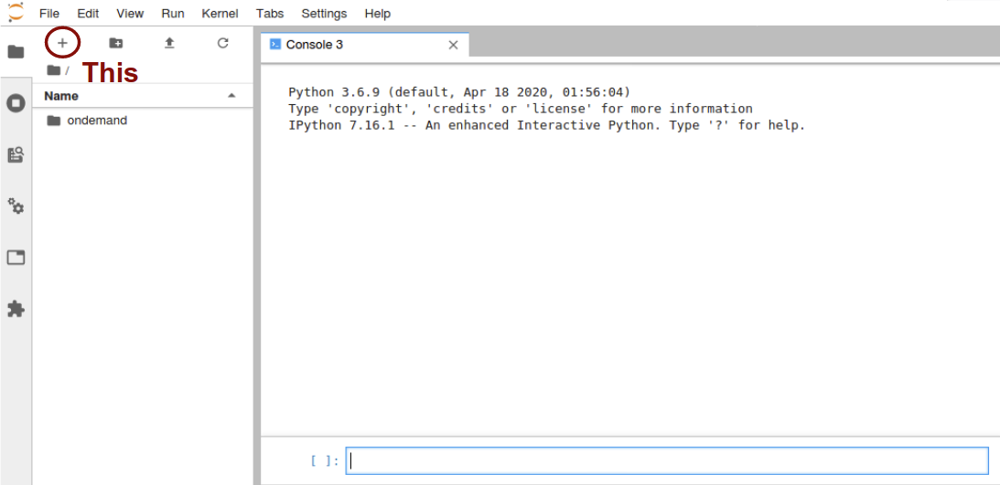

- Then choose a Terminal app and launch. You should see a terminal opened.

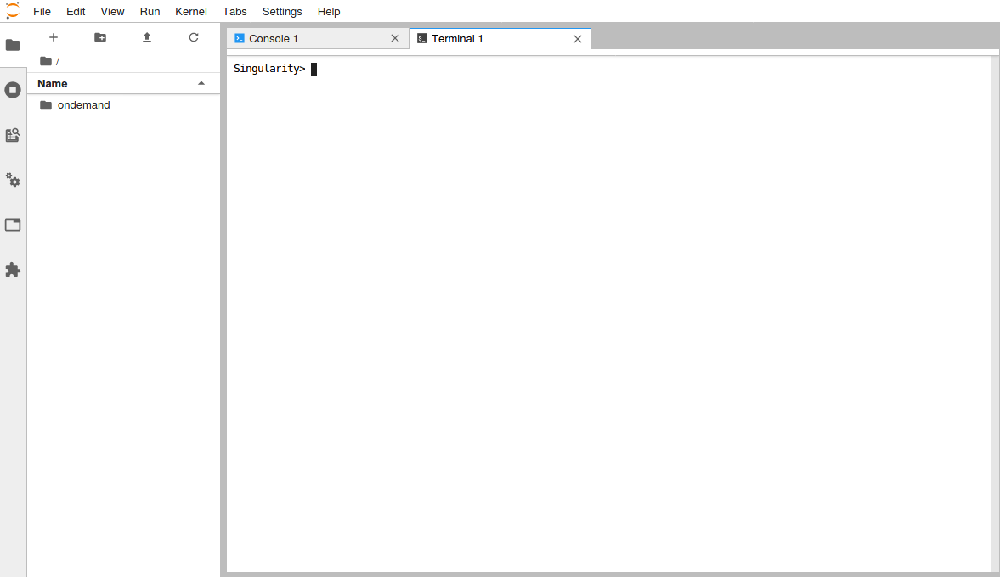

- In the terminal, type the command below
```
git clone https://github.com/drinkingkazu/slacml-kmi2020
```
... and execute (hit enter key). You should see the following outputs.

- It should look like below (and again, if not, [hit Kazu](mailto:kterao@slac.stanford.edu)!).

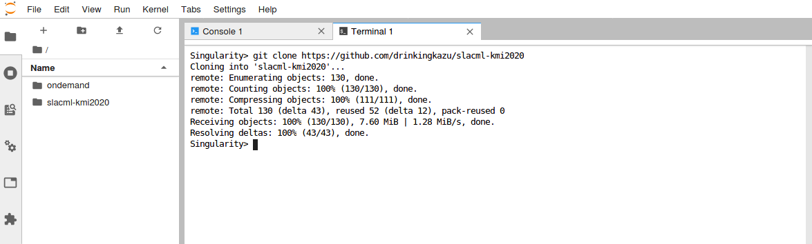

- Now on your file browser on the left, you should see `slacml-kmi2020` appeared! You can double-click to navigate through the directories and files. Go to the `slacml-kmi2020/Prerequisites` directory. You should see a list of notebooks to be completed prior to the workshop. Make sure you can execute all notebooks in this environment. If you double-click `Python-01-Jupyter.ipynb`, you should see something like below.

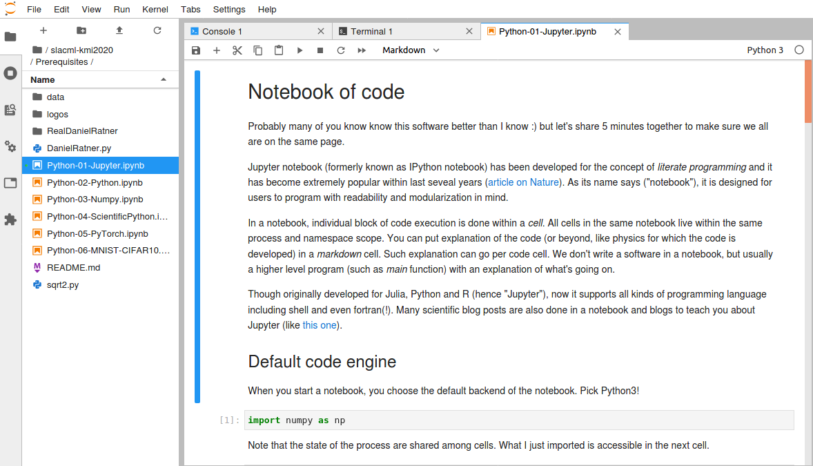

### 5. Party!

Congrats! You have your computing instance up and running = ready for the workshop ... **hardware-wise** :)

We assume some minimal knowledge about Python and scientific libraries. You just checked out the workshop repository, so you can go there and explore `~/slacml-kmi2020/Prerequisites` directory, or [read it online](/Prerequisites/README.md). There are notebooks named **Python-0X-YYY.ipynb**. Start from 01 and try to look at look at all of them. You can execute all notebooks and see what happens. Modify and observe a difference in behavior. Again, [hit Kazu](mailto:kterao@slac.stanford.edu) for questions!
